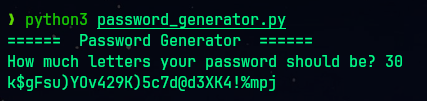

# Password Generator

A simple local password generator written in Python.
It generates secure passwords using letters, numbers, and symbols.

The goal of this project is to practice Python programming and provide
a simple tool to create stronger passwords for personal use.



---


## 🔑 Features 

- Generates random secure passwords
- Includes letters, numbers, and symbols
- Runs locally (offline)
---


## 🔄 Requirements

- Python 3.x installed

---


## 🚀 Usage

1. Clone the repository:
    ```bash
    git clone https://github.com/d4vidlinux/password-generator.git
    cd password-generator
    ```

2. Python Installation:
[Download Python](https://www.python.org/downloads)

3. Execution:
    ```bash
    python3 password_generator.py
    ```


---


## ⚠️ Warning

This is a simple local password generator created for learning and personal use.
It does not store, encrypt, or manage passwords.

Do not use this tool as replacement for professional password managers
such as 1Password, Bitwarden, or similar solutions.

---
